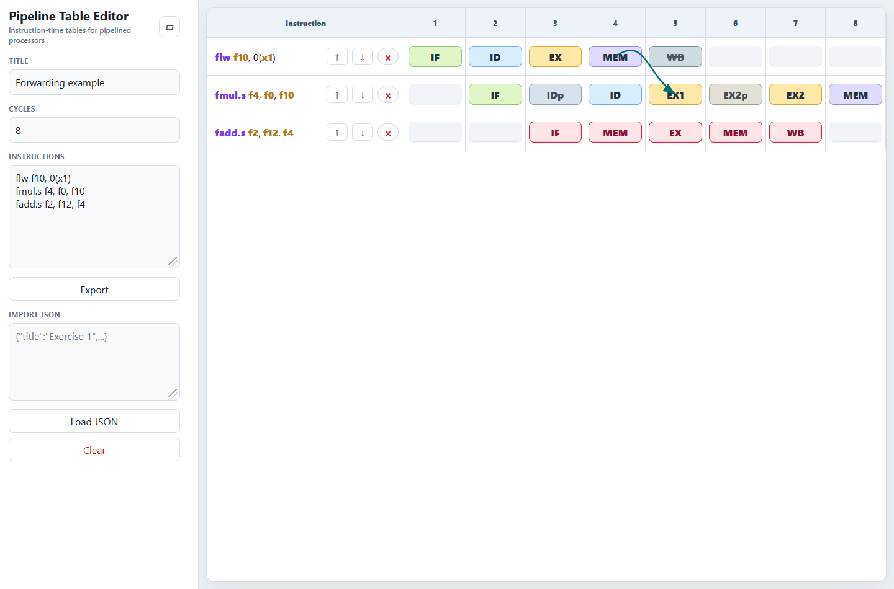

# Pipeline Table Editor

A static web editor for instruction-time pipeline tables.

[Open the web app on GitHub Pages](https://r3neer.github.io/pipeline-table-editor/)

The app helps draw and document pipeline tables: fast cell editing, visual stage validation, crossed-out cells, row labels, visual row separators, forwarding arrows, JSON import/export, Markdown/plain-text export, and local persistence with `localStorage`.

It is not a pipeline simulator: it does not calculate hazards, CPI, conflicts, or insert stalls automatically.

## Screenshot

<p align="center">
  
</p>

Additional screenshots:

- [Context menu](./app/docs/screenshots/context-menu.png)
- [Export menu](./app/docs/screenshots/export-menu.png)
- [Validation and autocomplete](./app/docs/screenshots/validation-and-autocomplete.png)

## Web Usage

Use the published app at:

```text
https://r3neer.github.io/pipeline-table-editor/
```

## Local Usage

On Windows, open the app with a double click:

```text
OPEN_PIPELINE_EDITOR.bat
```

That file installs dependencies if needed, starts Vite, and opens `http://127.0.0.1:5173/` in the browser.

Manual usage:

```bash
cd app
npm install
npm run dev
```

To create a deployable static build:

```bash
npm run build
```

The output is written to `dist/`.

## Structure

- `OPEN_PIPELINE_EDITOR.bat`: launcher for opening the app with a double click on Windows.
- `app/`: web app source code, Vite configuration, and tests.
  - `app/src/main.ts`: lightweight application coordinator and event wiring.
  - `app/src/core/`: data model, state normalization, labels, stage parsing, validation, autocomplete, arrow, row, selection, and expansion rules.
  - `app/src/core/useCases/`: deterministic table-editing workflows with no DOM access.
  - `app/src/app/`: application controllers grouped by interaction domain: cells, rows, menus, modes, rendering, selection, modals, workflows, events, persistence, plus transient session types.
  - `app/src/integration/`: browser integration that adapts app state to external services such as `localStorage`.
  - `app/src/ui/`: DOM helpers, split-table scrolling/layout, autocomplete menu rendering, floating positioning, arrow drawing, download helpers, and small table presentation helpers.
  - `app/src/export/`: Markdown/text/JSON/PNG export code and export format metadata.
  - `app/src/styles.css`: style entrypoint that imports visual-domain CSS files from `app/src/styles/`.
  - `app/tests/`: unit, integration-style, screenshot, and browser smoke tests.
- `codex/`: auxiliary notes for Codex work.
- `README.md` and `LICENSE`: public project documentation.

See [`app/docs/architecture.md`](./app/docs/architecture.md) for module diagrams, class diagrams, and sequence diagrams. The ongoing large-refactor plan, multi-agent ownership model, file-size policy, and commit policy live in [`app/docs/refactor-plan.md`](./app/docs/refactor-plan.md).

## Scripts

- `npm run dev`: local Vite server.
- `npm run build`: TypeScript check and static build.
- `npm run preview`: previews `dist/`.
- `npm run audit:file-sizes`: reports code/style/test files over 100 lines, warns over 300, and fails over 500.
- `npm run screenshots`: regenerates documentation screenshots.
- `npm run test:unit`: fast unit tests for domain rules.
- `npm run test:integration`: integration-style unit tests for extensibility seams, storage, export services, visual class composition, and table-editing use cases.
- `npm run test:all`: unit, integration, and browser smoke tests.
- `npm run test:smoke`: browser smoke test.

`npm run audit:file-sizes` is expected to pass. Files over 300 lines are still reported as warnings and should be reviewed during the next refactor pass.

## Architecture And Refactor Policy

The project is framework-free and keeps a strict split between:

- `core/`: DOM-free domain model, validation, autocomplete, rows, arrows, expansion, and state rules.
- `core/useCases/`: deterministic state-changing workflows.
- `app/`: application controllers and transient session state.
- `integration/`: thin browser adapters such as `localStorage`.
- `ui/`: DOM helpers and presentation mechanics.
- `export/`: JSON, Markdown, plain text, and PNG output.

The current refactor direction is to keep `app/src/main.ts` as the composition root while moving cohesive workflows into small controllers and helpers. The documented size policy is:

- Review files over 100 lines for responsibility boundaries.
- Plan or justify files over 300 lines.
- Treat code/style/test files over 500 lines as priority architecture debt.

## Cell Format

Valid stage roots are `IF`, `ID`, `EX`, `MEM`, and `WB`.

Accepted formats:

- `ROOT`
- `ROOTp`
- `ROOTn`, where `n` is a positive integer
- `ROOTnp`, when allowed by the previous numbered stage

Invalid cells are marked visually, but the app does not block editing.

## Row Notes

Right-click an instruction row to add or remove a row label, toggle a visual separator above the row, or use the `Edit` submenu for `Clear`, `Copy`, `Cut`, and `Paste` on the instruction text.

Instruction rows support multi-selection with `Shift` and `Ctrl`/`Cmd`. Row move and delete buttons apply to the selected block. Cell selections and instruction-row selections are mutually exclusive.

Labels and separators are manual annotations. They are exported in JSON, Markdown, plain text, and PNG, but they do not add control-flow simulation or branch validation.

## Release

Current GitHub-ready version: `v0.2.2`.

GitHub Pages is deployed automatically when a GitHub release is published. The
workflow builds `app/dist/` and publishes it at
`https://r3neer.github.io/pipeline-table-editor/`. It can also be run manually
from **Actions > Deploy GitHub Pages > Run workflow**.
