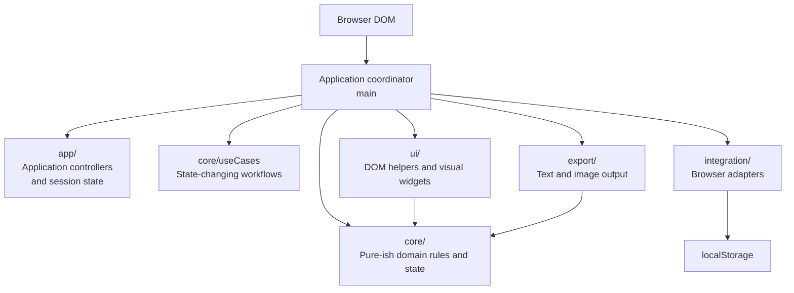
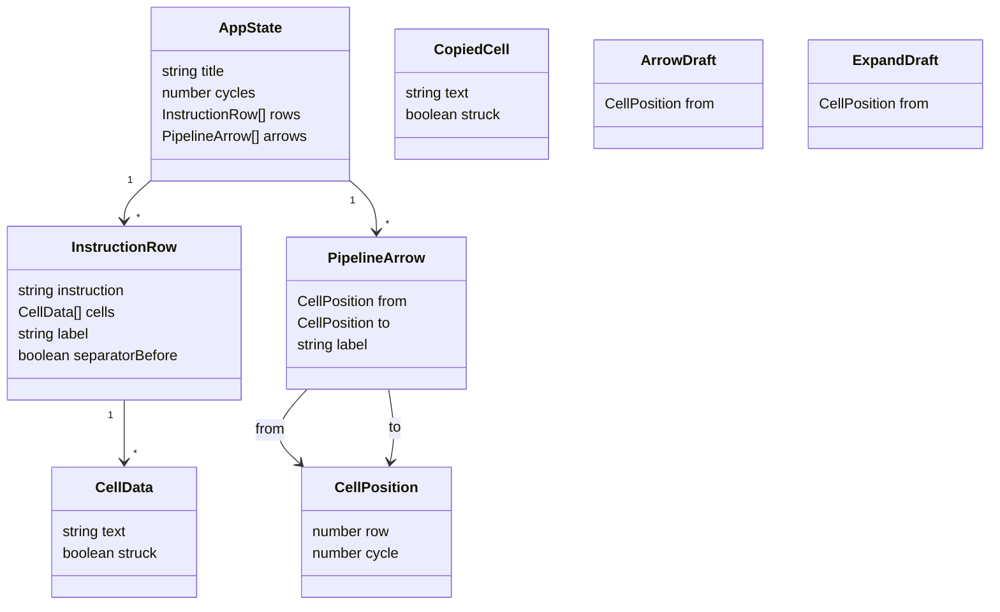
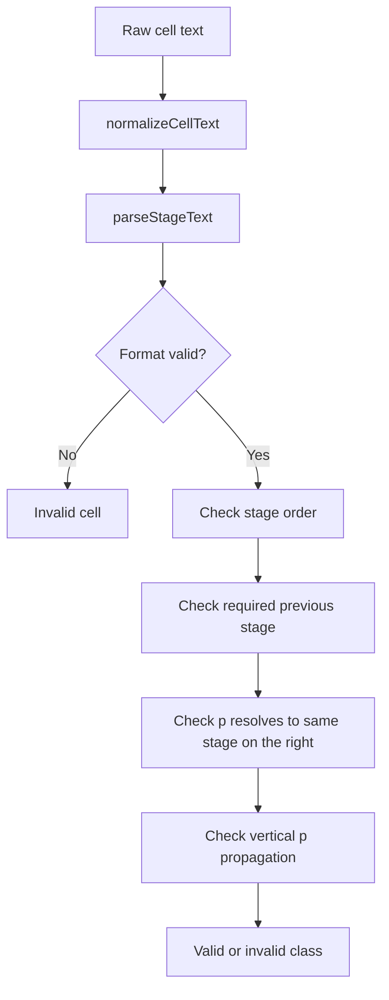
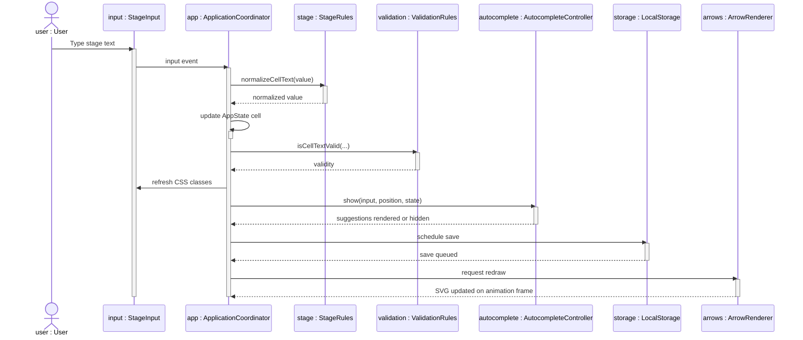
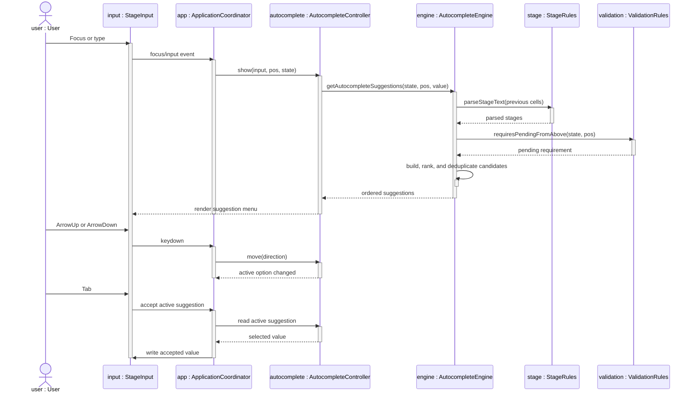
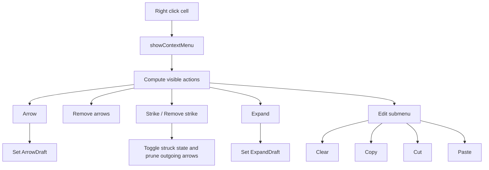
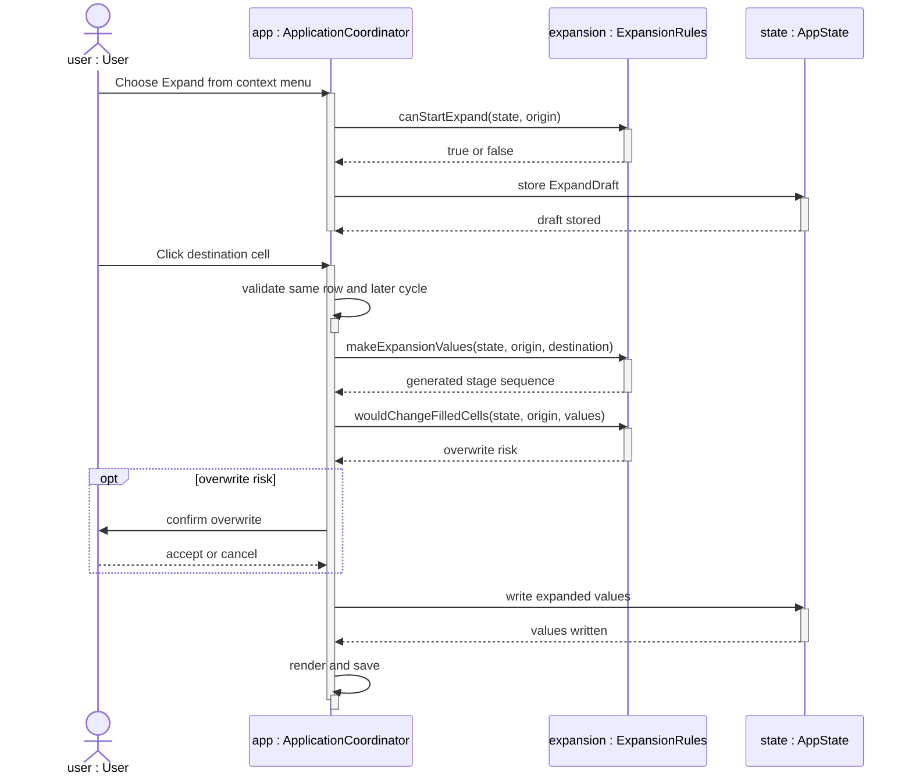
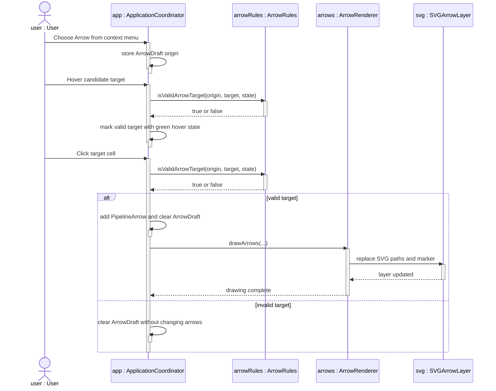
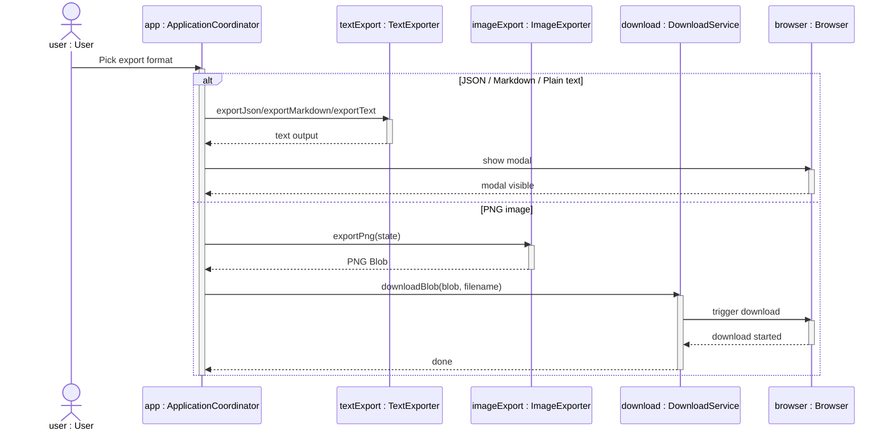
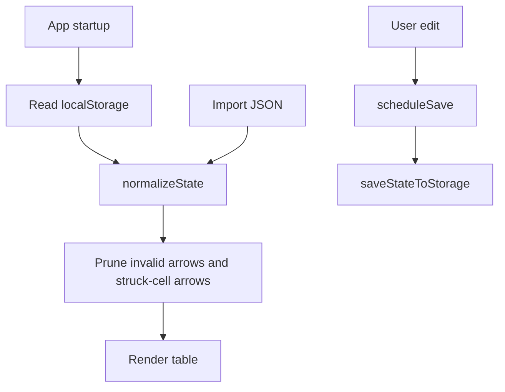

# Architecture

This document explains the architecture of Pipeline Table Editor. It is written so a reader can understand how the app is built without opening the source code first.

The app is intentionally small and framework-free: TypeScript, Vite, browser DOM APIs, SVG, canvas, and `localStorage`.

The active refactor plan, file-size policy, multi-agent ownership model, and commit policy are tracked in [`refactor-plan.md`](./refactor-plan.md).

The main design goal is to keep pipeline-table editing explicit and predictable. The app validates and visualizes user-entered stages, but it does not simulate a processor or infer hazards automatically.

## Architectural Summary

Pipeline Table Editor is a client-only static web app. It has one in-memory `AppState`, rendered directly into the DOM by the application coordinator. User actions mutate that state, refresh the affected UI, schedule persistence, and redraw SVG forwarding arrows when needed. The table is rendered as a fixed instruction pane next to a horizontally scrollable cycle viewport so instruction labels stay visible while navigating long timelines.

The code follows a small layered split:

- `core/`: domain model and deterministic rules with no direct DOM access.
- `core/useCases/`: deterministic state-changing workflows with no direct DOM access.
- `app/`: application controllers and transient application-session state that are not part of the persisted model.
- `integration/`: adapters for browser integration points such as `localStorage`.
- `ui/`: browser-facing helpers for DOM lookup, autocomplete rendering, SVG arrows, and downloads.
- `export/`: output generation for JSON, Markdown, plain text, and PNG.

`main.ts` is intentionally the broad composition root. It creates browser elements, mutable state, controllers, event bindings, rendering, and persistence adapters. It should stay thin: pure rules belong in `core/`, browser adapters belong in `integration/`, reusable presentation helpers belong in `ui/`, and cohesive interaction workflows belong in `app/` controllers.

## Directory Layout

```text
app/src/
├─ app/
│  ├─ appContext.ts
│  ├─ appEventBindings.ts
│  ├─ arrowAndExpansionController.ts
│  ├─ cellActionController.ts
│  ├─ cellEditingController.ts
│  ├─ contextMenuController.ts
│  ├─ exportImportController.ts
│  ├─ labelModalController.ts
│  ├─ modalController.ts
│  ├─ persistenceController.ts
│  ├─ rowEditingController.ts
│  ├─ selectionController.ts
│  ├─ sessionTypes.ts
│  └─ tableWorkflowController.ts
├─ main.ts
├─ styles.css
├─ styles/
│  ├─ base.css
│  ├─ arrow-layer.css
│  ├─ instruction-rows.css
│  ├─ overlays.css
│  ├─ responsive.css
│  ├─ sidebar.css
│  ├─ stage-cells.css
│  ├─ table.css
│  └─ table-layout.css
├─ core/
│  ├─ assembly.ts
│  ├─ arrows.ts
│  ├─ autocomplete.ts
│  ├─ autocompleteContext.ts
│  ├─ autocompleteHistory.ts
│  ├─ autocompleteProviders.ts
│  ├─ autocompleteRanking.ts
│  ├─ autocompleteRowAnalysis.ts
│  ├─ autocompleteTypes.ts
│  ├─ autocompleteValidation.ts
│  ├─ labels.ts
│  ├─ expansion.ts
│  ├─ model.ts
│  ├─ rows.ts
│  ├─ selection.ts
│  ├─ stage.ts
│  ├─ state.ts
│  ├─ useCases/
│  │  └─ tableEditing.ts
│  └─ validation.ts
├─ integration/
│  └─ storage.ts
├─ export/
│  ├─ image.ts
│  ├─ index.ts
│  ├─ service.ts
│  └─ types.ts
└─ ui/
   ├─ arrows.ts
   ├─ assemblyHighlight.ts
   ├─ autocomplete.ts
   ├─ cellClasses.ts
   ├─ dom.ts
   ├─ download.ts
   ├─ instructionColumnWidth.ts
   ├─ menuActions.ts
   ├─ positioning.ts
   ├─ splitTable.ts
   └─ tableElements.ts
```

## Layering



The application coordinator owns the mutable app state and wires browser events to application controllers. It still performs table rendering directly, but cohesive workflows such as selection, context-menu handling, cell editing, row editing, modal handling, row-label editing, persistence, import/export, and arrow/expansion drafts live in `app/` modules.

The `core/` modules avoid direct DOM and browser-storage access. They hold the serializable data model, stage parsing, validation rules, selection utilities, expansion rules, assembly tokenization, and persisted-state normalization.

The `core/useCases/` modules own deterministic state-changing workflows that are still business logic, such as applying instruction text, changing cycle count, and pruning arrows after edits.

The `app/` modules hold application-level controllers and session-only interaction state. These modules may coordinate `core/`, `ui/`, `integration/`, and `export/`, but they should expose small APIs back to `main.ts` instead of importing each other through hidden globals.

The `integration/` modules adapt external browser services to the app. They may call browser APIs, but they should keep that work thin and delegate parsing or validation back to `core/`.

The `ui/` modules work with DOM-specific behavior: locating elements, rendering highlighted assembly text, rendering autocomplete options, drawing SVG arrows, and triggering browser downloads.

The `export/` modules produce external representations. `export/index.ts` contains JSON, Markdown, and plain-text export; `export/image.ts` renders a high-resolution PNG using canvas.

## Module Responsibilities

| Area | Modules | Responsibility |
| --- | --- | --- |
| Application composition | `main.ts` | Owns `AppState`, renders the table, wires browser events, and delegates cohesive workflows to application controllers. |
| Event binding | `app/appEventBindings.ts` | Wires global DOM events to controllers and keeps listener details out of the composition root. |
| Application controller context | `app/appContext.ts` | Defines shared controller contracts so feature controllers depend on explicit app capabilities rather than broad imports. |
| Selection controller | `app/selectionController.ts` | Owns cell/row selection state and selection operations without DOM access. `main.ts` decides when to refresh classes. |
| Cell action controller | `app/cellActionController.ts` | Owns simple cell actions and cell clipboard state: clear, copy, cut, paste, and strike toggling. |
| Cell editing controller | `app/cellEditingController.ts` | Owns stage-cell DOM handlers, keyboard navigation, autocomplete acceptance, simple cell actions, and cell clipboard state. |
| Context menu controller | `app/contextMenuController.ts` | Owns cell/row context-menu state, menu visibility, action availability, submenu positioning, and action dispatch through callbacks. |
| Modal controller | `app/modalController.ts` | Owns confirm/notice modal state and resolution. |
| Label modal controller | `app/labelModalController.ts` | Owns row-label modal state, label normalization, save/cancel behavior, and modal event binding. |
| Persistence controller | `app/persistenceController.ts` | Debounces saves and delegates actual storage to `integration/storage.ts`. |
| Row editing controller | `app/rowEditingController.ts` | Coordinates instruction-row add/remove/move/edit actions, row clipboard state, confirmations, render, and save scheduling. |
| Table workflow controller | `app/tableWorkflowController.ts` | Coordinates whole-table workflows such as instruction textarea application, cycle count changes, and full-table clearing. |
| Export/import controller | `app/exportImportController.ts` | Coordinates text export, PNG export, JSON import, clipboard copy, and export menu state. |
| Arrow and expansion controller | `app/arrowAndExpansionController.ts` | Owns arrow draft, hover target, expansion draft, arrow removal, arrow drawing orchestration, and overwrite confirmations. |
| Session types | `app/sessionTypes.ts` | Defines transient copied-cell and draft interaction state that is not persisted. |
| Domain model | `core/model.ts` | Defines serializable pipeline-table state. |
| Row labels | `core/labels.ts` | Normalizes labels and assigns stable, subdued colors. |
| Stage syntax | `core/stage.ts` | Normalizes and parses stage text such as `IF`, `EX2`, or `IDp`. |
| Autocomplete rules | `core/autocomplete*.ts` | Builds ranked stage suggestions through a small facade plus provider, ranking, context, history, row-analysis, validation, and type modules. |
| Validation | `core/validation.ts` | Applies visual error rules for stage order, missing previous stages, and pending `p` suffixes. |
| Arrow rules | `core/arrows.ts` | Validates forwarding arrow shape, target constraints, duplicate incoming targets, and row remapping. |
| Row rules | `core/rows.ts` | Moves and removes instruction rows, remaps arrows, and computes row action targets for single or multi-row selection. |
| Expansion | `core/expansion.ts` | Computes `Expand` results and whether filled cells would actually change. |
| Selection | `core/selection.ts` | Builds rectangular, vertical, and keyed multi-cell selections. |
| State rules | `core/state.ts` | Creates default state, rows, and normalizes serializable app state. |
| Table-editing use cases | `core/useCases/tableEditing.ts` | Applies instruction text, changes cycle count, removes outgoing arrows, and prunes struck-cell arrows without DOM access. |
| Assembly highlighting | `core/assembly.ts` | Tokenizes assembly instructions into instruction/register/plain tokens. |
| Browser persistence | `integration/storage.ts` | Loads/saves normalized state through `localStorage`. |
| DOM helpers | `ui/dom.ts` | Reads required DOM elements and extracts dataset-backed input positions. |
| Assembly highlight UI | `ui/assemblyHighlight.ts` | Renders tokenized assembly text and known labels into DOM spans. |
| Autocomplete UI | `ui/autocomplete.ts` | Displays suggestions, handles active option movement, and emits accepted values. |
| Cell class composition | `ui/cellClasses.ts` | Translates domain and session state into stable CSS class names for stage cells. |
| Arrow drawing | `ui/arrows.ts` | Regenerates SVG paths and arrowheads from stored arrow positions. |
| Download helpers | `ui/download.ts` | Creates object URLs and triggers browser downloads. |
| Instruction column width | `ui/instructionColumnWidth.ts` | Computes and applies the responsive instruction-column width from rendered content. |
| Floating positioning | `ui/positioning.ts` | Keeps autocomplete menus, context menus, and submenus inside the viewport. |
| Split table layout | `ui/splitTable.ts` | Synchronizes instruction and cycle panes, vertical wheel scrolling, row heights, overflow classes, and bottom breathing room. |
| Table element helpers | `ui/tableElements.ts` | Creates small reusable DOM elements such as table headers, row buttons, and scrollbar spacers. |
| Text exports | `export/index.ts` | Generates JSON, Markdown, and plain text. |
| Export service | `export/service.ts` | Chooses text export content and file metadata such as MIME type and extension. |
| Image export | `export/image.ts` | Renders a high-resolution PNG with canvas. |

## Design Pattern Notes

The project uses patterns only where they remove real coupling:

- `app/*Controller.ts` modules are small Controllers/Facades around cohesive workflows. They reduce `main.ts` coupling without introducing framework state or class-heavy architecture.
- `ui/splitTable.ts` acts as a small Mediator between the instruction pane and the cycle viewport. Vertical scrolling, row-height synchronization, and overflow state are coordinated there so `main.ts` does not need to know the mechanics of the split table.
- `core/autocomplete.ts` is a Facade over Strategy-like suggestion providers in `core/autocompleteProviders.ts`; ranking, context building, history heuristics, row numbering, and candidate validation are separate modules. New suggestion providers can be added without changing unrelated presentation code.
- `core/validation.ts` uses a Strategy-like rule pipeline. New validation rules can be added without changing presentation code.
- `integration/storage.ts` is an Adapter around `localStorage`; `app/persistenceController.ts` is the debounced application workflow that calls it.
- `main.ts` still behaves as the composition root for browser events. A full Command pattern for every menu action is intentionally deferred because current actions are simple, direct, and easier to review as functions.

Architectural review notes:

- Priority 1: keep extracting cohesive controllers from `main.ts`, especially context menus and cell/row editing. These are Controller/Facade opportunities with low risk and clear review boundaries.
- Priority 2: consider a small command registry only if context-menu actions continue to grow. Today, a full Command pattern would mostly move simple `if` statements into a map.
- Priority 3: consider a dedicated table view module once editing controllers are smaller. `renderTable()` remains the next large presentation responsibility.
- Avoid introducing an event bus for now. Explicit callbacks and narrow context objects make dependencies easier to audit in a framework-free app.

This keeps the code aligned with SOLID in the practical sense: domain rules are testable without the DOM or browser storage, integration adapters isolate external services, UI helpers own browser presentation mechanics, and abstractions are introduced only where they reduce concrete coupling.

## Core Model



The state shape is deliberately serializable. JSON import/export and `localStorage` persistence use the same structure.

`AppState` is the central data structure:

- `title`: the document title shown in the editor and exports.
- `cycles`: the number of cycle columns.
- `rows`: one row per assembly instruction.
- `arrows`: forwarding arrows stored as source and target cell positions.

Each row may also store a manual `label` and `separatorBefore` marker. These are visual annotations only: they do not imply branch direction, loop execution, or control-flow validation.

Each cell stores only user-authored stage text and whether it is struck through. CSS classes, validation state, autocomplete suggestions, and SVG paths are derived from `AppState` instead of persisted separately.

## Stage Parsing And Validation

Stage parsing is centralized in `core/stage.ts`. Higher-level stage validation lives in `core/validation.ts` as a `CellValidationRule[]` pipeline.

Accepted stage roots:

- `IF`
- `ID`
- `EX`
- `MEM`
- `WB`

Accepted cell formats:

- `ROOT`
- `ROOTp`
- `ROOTn`
- `ROOTnp`



Validation is intentionally visual. Invalid cells are marked with `stage-invalid`; editing remains unrestricted.

`validateCellText()` returns both a boolean result and the failed rule id. `createCellValidator()` builds alternate validators from custom rule lists, which keeps new validation modes open for extension without forcing callers to grow more conditional logic.

Important validation rules:

- Stages must appear in pipeline order within a row.
- A stage requires previous stage roots to exist earlier in that row.
- A `p` stage must be followed by the same stage without `p`.
- A numbered pending stage such as `EX2p` must also follow the previous number, such as `EX1`.
- If a column has a `p` stage above, non-empty cells below must also use a `p` suffix until a blank cell stops the vertical propagation.

## Main Editing Sequence



`refreshCellClasses()` recalculates all stage cells because some rules depend on neighboring cells and cells above the current one.

## Autocomplete Rules

Autocomplete is split in two layers:

- `core/autocomplete.ts` is the pure suggestion-engine facade. It receives `AppState`, a `CellPosition`, and the raw input text, then delegates to ordered `SuggestionProvider` functions and returns ordered string suggestions.
- `ui/autocomplete.ts` is the DOM controller. It positions the menu, renders buttons, moves the active option, and dispatches accepted values.

The core engine builds suggestions through small candidate rules in `core/autocompleteProviders.ts`: exact valid input, pending continuation, historical next stage, numbered continuation, next stage root, and allowed local roots. Ranking lives in `core/autocompleteRanking.ts`, historical transition detection in `core/autocompleteHistory.ts`, local row numbering in `core/autocompleteRowAnalysis.ts`, contextual root preferences in `core/autocompleteContext.ts`, and candidate validity in `core/autocompleteValidation.ts`. That keeps the menu from suggesting stages that the validator already knows cannot be valid, especially around vertical pending-stage propagation and numbered pending stages.

New autocomplete behavior should be added as another provider in the provider list. Providers can add candidates, rely on the shared collector for filtering/deduplication, or return `stop` when no later provider should run.

The historical rule looks only at previous rows. If earlier rows consistently show a transition such as `MEM1 -> MEM2 -> WB`, then `WB` is ranked before speculative continuations such as `MEM3` after the current row reaches `MEM2`.

## Autocomplete Sequence



`Enter` and `Tab` accept the highlighted option. `ArrowUp` and `ArrowDown` move through autocomplete options while the menu is open instead of moving between cells.

## Context Menu And Cell Actions



The menu is state-sensitive:

- `Arrow` is hidden for struck cells and multi-selection.
- `Remove arrows` appears only when the cell has outgoing arrows and is not struck.
- `Expand` is hidden for struck cells and invalid expansion origins.
- `Copy` and `Cut` are hidden for multi-selection.

Instruction rows have a separate context menu. It can add or edit a row label, remove an existing label, toggle a separator above the row, or open an `Edit` submenu with `Clear`, `Copy`, `Cut`, and `Paste` for instruction text. Labels are colored with a stable hash-based palette and the same color is used when a known label appears inside assembly text.

Rows support their own selection state. `Shift` selects a contiguous block of instruction rows and `Ctrl`/`Cmd` toggles individual rows. Cell selections and row selections are mutually exclusive: entering one mode clears the other. Selection state and selection math live in `app/selectionController.ts` with help from `core/selection.ts`; `main.ts` handles DOM refresh. Row move and delete buttons apply to the selected row block when the clicked button belongs to that block. The deterministic row mutation work lives in `core/rows.ts`; `main.ts` handles confirmations, rendering, and persistence.

## Expansion Sequence



Expansion rules are pure domain logic in `core/expansion.ts`; draft state, overwrite confirmation, rendering, and persistence orchestration live in `app/arrowAndExpansionController.ts`.

## Forwarding Arrow Sequence



Arrows are stored in state as row/cycle positions. `app/arrowAndExpansionController.ts` owns arrow draft state and coordinates validation with `core/arrows.ts`; `ui/arrows.ts` only draws the SVG layer. The SVG layer is regenerated from state whenever the table changes, scrolls, or resizes. Arrow creation is single-shot: the first clicked target either creates a valid arrow or cancels the draft. A cell that already has an incoming arrow is not a valid target for another arrow.

## Export Sequence



PNG export uses an opaque white background instead of transparency. This is safer for tables because the image remains legible when pasted into documents, PDFs, slides, or dark-background viewers.

## Persistence And Import



`core/state.ts` normalizes imported or persisted data. It ensures row lengths match the cycle count, cell text is normalized, and arrows are structurally usable before they are kept. `integration/storage.ts` is the only module that reads or writes `localStorage`.

## Runtime State And Rendering

The app does not use a virtual DOM or framework state store. Rendering is explicit:

1. `main` keeps the current `AppState` in memory.
2. `render()` rebuilds the fixed instruction pane and scrollable cycle table, then synchronizes sidebar controls.
3. Individual input handlers update state immediately.
4. CSS classes are derived from current validation and interaction state.
5. The SVG arrow layer is redrawn after table updates, scrolling, and resizing.
6. A debounced save passes the serializable state to the storage integration adapter.

Selection state, context-menu state, cell clipboard state, row-editing workflow state, table workflow orchestration, label-modal state, and arrow/expansion draft state used to live directly inside `main.ts`; they now live in dedicated `app/` controllers. This keeps rendering explicit while giving those interaction workflows their own testable boundaries.

This direct rendering style is simple enough for the size of the project and keeps deployment as a static site.

## Testing Strategy

The test suite has three complementary layers:

- `tests/core.test.ts` runs fast unit tests for DOM-free rules.
- `tests/integration.test.ts` runs integration-style unit tests around extension seams, adapters, services, visual class composition, and DOM-free use cases.
- `tests/browser-smoke.ts` exercises the integrated app through a real browser.

The unit tests cover:

- stage parsing and normalization
- accepted and rejected stage formats
- horizontal pending-stage resolution
- vertical pending-stage propagation
- contextual autocomplete ranking and filtering
- expansion value generation and overwrite detection
- arrow target validation
- row movement/removal with arrow remapping
- JSON serialization followed by state normalization

The integration-style unit tests cover:

- custom validation rules and custom autocomplete providers
- `localStorage` adapter behavior through an injected `Storage`
- export service MIME/extension metadata
- stage-cell class composition without rendering the full app
- table-editing use cases for instruction text, cycle changes, and arrow pruning

The smoke test covers:

- table rendering
- cell validation
- autocomplete keyboard behavior
- stage color classes
- `p` suffix rules
- expansion
- context menu behavior
- multi-selection
- instruction-row labels, edit actions, and row multi-selection
- arrows
- split table layout and native scrolling
- JSON, Markdown, text, and PNG export
- import and persistence

The smoke test remains broad because many visible features interact through shared state, scrolling, focus, and browser layout.

## File Size Audit

`npm run audit:file-sizes` checks code, style, and test files under `src/`, `tests/`, and `scripts/`.

Thresholds:

- over 100 lines: review responsibility boundaries
- over 300 lines: warn and require a split plan or clear justification
- over 500 lines: fail, unless the file is a documented exception

The audit is expected to pass. Remaining `>300` warnings are treated as refactor planning signals rather than release blockers.

The audit does not include Markdown reference documents because long-form documentation can be valid when it remains well sectioned and easy to scan.

## Architectural Boundaries

Keep these boundaries when adding new features:

- Add stage syntax and parsing rules in `core/stage.ts`.
- Add validation rules in `core/validation.ts`.
- Add autocomplete candidate behavior as a `SuggestionProvider` in `core/autocompleteProviders.ts`; keep ordering behavior in `core/autocompleteRanking.ts` and candidate validity checks in `core/autocompleteValidation.ts`.
- Add forwarding-arrow constraints in `core/arrows.ts`.
- Add deterministic table-editing workflows in `core/useCases/`.
- Keep application workflow coordination and transient UI/session state in `app/`, not in `core/model.ts`.
- Keep controller APIs small and explicit. Prefer passing callbacks/capabilities over importing `main.ts` state indirectly.
- Keep row labels and separators as manual annotations; do not use them to infer control flow.
- Keep browser storage, URL, clipboard, or other external-service adapters in `integration/` when they are not primarily visual UI.
- Keep DOM queries and element creation in `ui/` or `main.ts`.
- Keep file/download browser mechanics in `ui/download.ts`.
- Keep output formats in `export/`.
- Avoid adding automatic pipeline simulation logic; this editor should remain manual and explicit.
