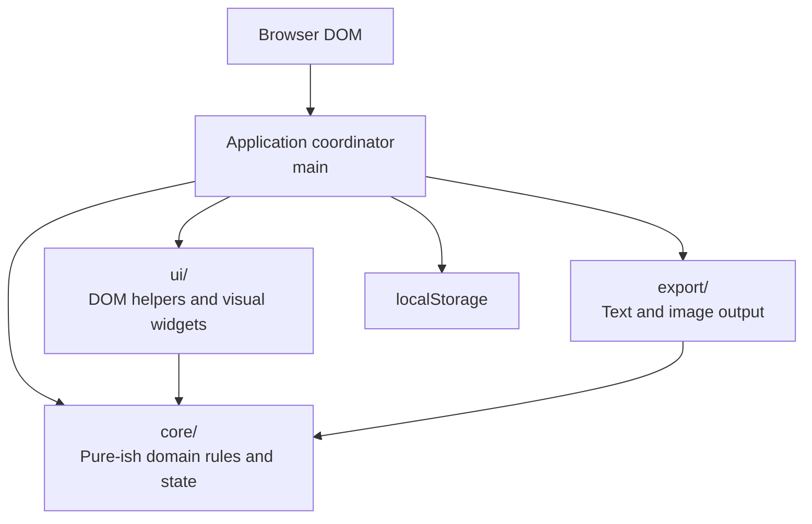
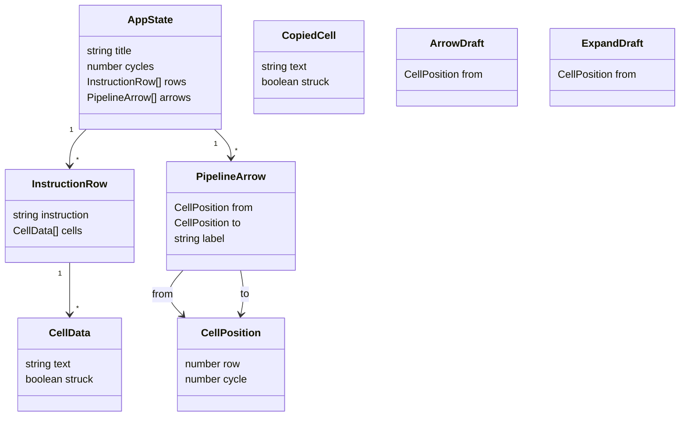
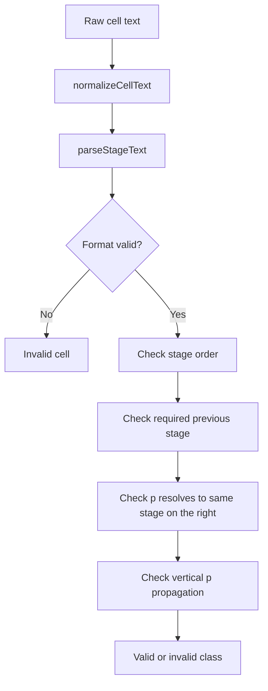
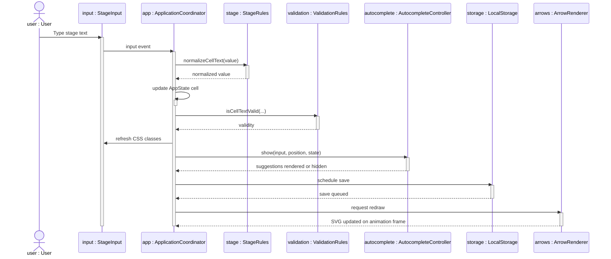
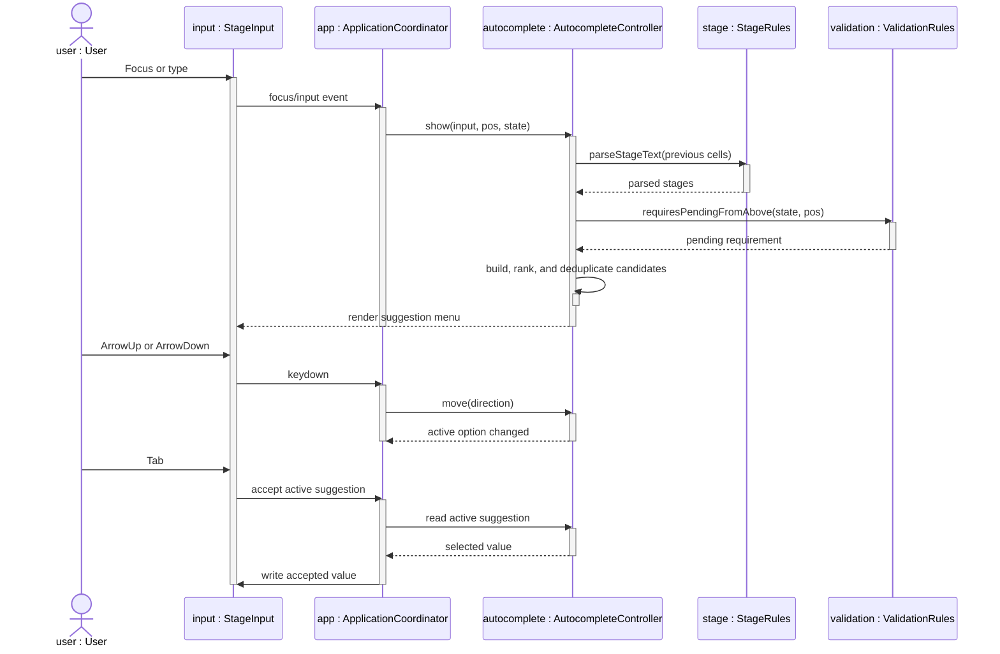
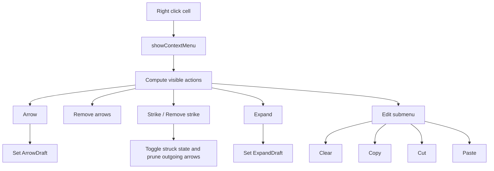
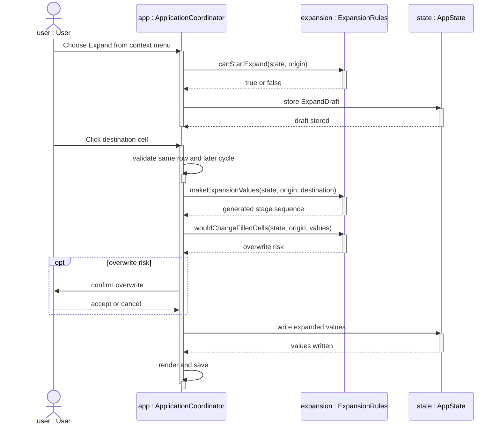
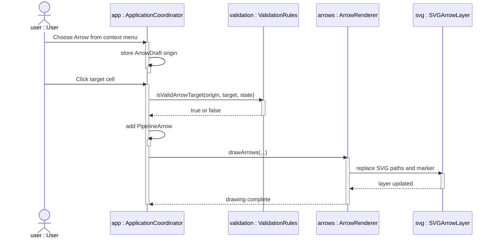
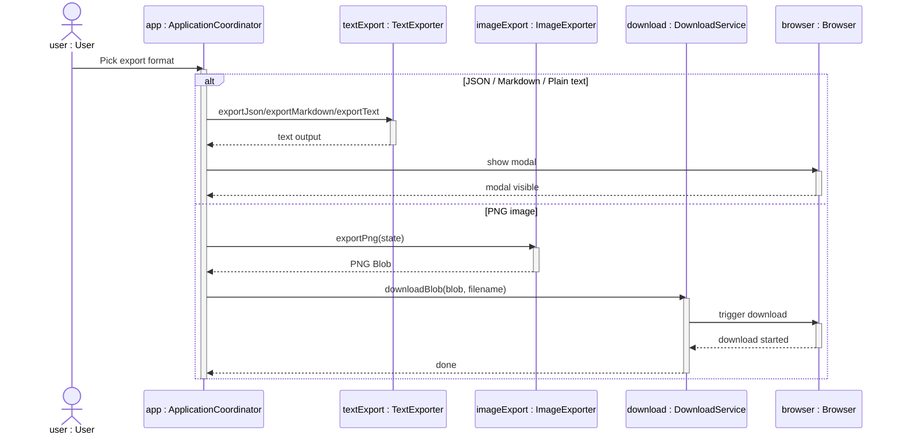
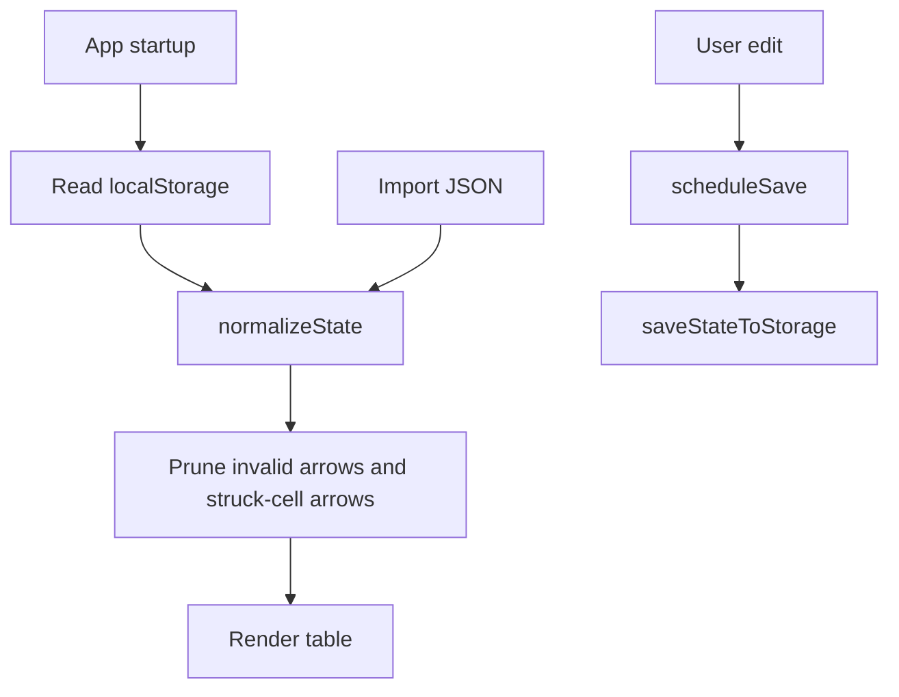

# Architecture

This document explains the architecture of Pipeline Table Editor. It is written so a reader can understand how the app is built without opening the source code first.

The app is intentionally small and framework-free: TypeScript, Vite, browser DOM APIs, SVG, canvas, and `localStorage`.

The main design goal is to keep pipeline-table editing explicit and predictable. The app validates and visualizes user-entered stages, but it does not simulate a processor or infer hazards automatically.

## Architectural Summary

Pipeline Table Editor is a client-only static web app. It has one in-memory `AppState`, rendered directly into the DOM by the application coordinator. User actions mutate that state, refresh the affected UI, schedule persistence, and redraw SVG forwarding arrows when needed.

The code follows a simple three-part split:

- `core/`: domain model and deterministic rules with no direct DOM access.
- `ui/`: browser-facing helpers for DOM lookup, autocomplete rendering, SVG arrows, and downloads.
- `export/`: output generation for JSON, Markdown, plain text, and PNG.

`main.ts` is intentionally the only broad coordinator. It connects browser events, mutable state, rendering, persistence, and feature modules. It should not accumulate new pure rules when those rules can live in `core/`.

## Directory Layout

```text
app/src/
├─ main.ts
├─ styles.css
├─ core/
│  ├─ assembly.ts
│  ├─ expansion.ts
│  ├─ model.ts
│  ├─ selection.ts
│  ├─ stage.ts
│  ├─ state.ts
│  └─ validation.ts
├─ export/
│  ├─ image.ts
│  └─ index.ts
└─ ui/
   ├─ arrows.ts
   ├─ autocomplete.ts
   ├─ dom.ts
   └─ download.ts
```

## Layering



The application coordinator owns the mutable app state, wires events, calls domain helpers, updates the DOM, schedules persistence, and redraws arrows.

The `core/` modules avoid direct DOM access. They hold the data model, stage parsing, validation rules, selection utilities, expansion rules, assembly tokenization, and persisted-state normalization.

The `ui/` modules work with DOM-specific behavior: locating elements, rendering autocomplete options, drawing SVG arrows, and triggering browser downloads.

The `export/` modules produce external representations. `export/index.ts` contains JSON, Markdown, and plain-text export; `export/image.ts` renders a high-resolution PNG using canvas.

## Module Responsibilities

| Area | Modules | Responsibility |
| --- | --- | --- |
| Application coordination | `main.ts` | Owns `AppState`, renders the table, handles events, coordinates persistence, arrows, autocomplete, context menu actions, import, and export. |
| Domain model | `core/model.ts` | Defines serializable state and UI helper types. |
| Stage syntax | `core/stage.ts` | Normalizes and parses stage text such as `IF`, `EX2`, or `IDp`. |
| Validation | `core/validation.ts` | Applies visual error rules for stage order, missing previous stages, pending `p` suffixes, and valid arrow targets. |
| Expansion | `core/expansion.ts` | Computes `Expand` results and whether filled cells would actually change. |
| Selection | `core/selection.ts` | Builds rectangular, vertical, and keyed multi-cell selections. |
| Persistence | `core/state.ts` | Creates, normalizes, loads, and saves serializable app state. |
| Assembly highlighting | `core/assembly.ts` | Tokenizes assembly instructions into instruction/register/plain tokens. |
| DOM helpers | `ui/dom.ts` | Reads required DOM elements and renders highlighted instruction text. |
| Autocomplete UI | `ui/autocomplete.ts` | Builds, ranks, displays, moves through, and accepts stage suggestions. |
| Arrow drawing | `ui/arrows.ts` | Regenerates SVG paths and arrowheads from stored arrow positions. |
| Download helpers | `ui/download.ts` | Creates object URLs and triggers browser downloads. |
| Text exports | `export/index.ts` | Generates JSON, Markdown, and plain text. |
| Image export | `export/image.ts` | Renders a high-resolution PNG with canvas. |

## Core Model



The state shape is deliberately serializable. JSON import/export and `localStorage` persistence use the same structure.

`AppState` is the central data structure:

- `title`: the document title shown in the editor and exports.
- `cycles`: the number of cycle columns.
- `rows`: one row per assembly instruction.
- `arrows`: forwarding arrows stored as source and target cell positions.

Each cell stores only user-authored stage text and whether it is struck through. CSS classes, validation state, autocomplete suggestions, and SVG paths are derived from `AppState` instead of persisted separately.

## Stage Parsing And Validation

Stage parsing is centralized in `core/stage.ts`.

Accepted stage roots:

- `IF`
- `ID`
- `EX`
- `MEM`
- `WB`

Accepted cell formats:

- `ROOT`
- `ROOTp`
- `ROOTn`
- `ROOTnp`



Validation is intentionally visual. Invalid cells are marked with `stage-invalid`; editing remains unrestricted.

Important validation rules:

- Stages must appear in pipeline order within a row.
- A stage requires previous stage roots to exist earlier in that row.
- A `p` stage must be followed by the same stage without `p`.
- A numbered pending stage such as `EX2p` must also follow the previous number, such as `EX1`.
- If a column has a `p` stage above, non-empty cells below must also use a `p` suffix until a blank cell stops the vertical propagation.

## Main Editing Sequence



`refreshCellClasses()` recalculates all stage cells because some rules depend on neighboring cells and cells above the current one.

## Autocomplete Sequence



`Enter` closes autocomplete instead of accepting the highlighted option. `Tab` accepts the highlighted option.

## Context Menu And Cell Actions



The menu is state-sensitive:

- `Arrow` is hidden for struck cells and multi-selection.
- `Remove arrows` appears only when the cell has outgoing arrows and is not struck.
- `Expand` is hidden for struck cells and invalid expansion origins.
- `Copy` and `Cut` are hidden for multi-selection.

## Expansion Sequence



Expansion rules are pure domain logic in `core/expansion.ts`; UI confirmation and rendering stay in `main.ts`.

## Forwarding Arrow Sequence



Arrows are stored in state as row/cycle positions. The SVG layer is regenerated from state whenever the table changes, scrolls, or resizes.

## Export Sequence



PNG export uses an opaque white background instead of transparency. This is safer for tables because the image remains legible when pasted into documents, PDFs, slides, or dark-background viewers.

## Persistence And Import



`core/state.ts` normalizes imported or persisted data. It ensures row lengths match the cycle count, cell text is normalized, and arrows are structurally usable before they are kept.

## Runtime State And Rendering

The app does not use a virtual DOM or framework state store. Rendering is explicit:

1. `main` keeps the current `AppState` in memory.
2. `render()` rebuilds the editable table and synchronizes sidebar controls.
3. Individual input handlers update state immediately.
4. CSS classes are derived from current validation and interaction state.
5. The SVG arrow layer is redrawn after table updates, scrolling, and resizing.
6. A debounced save writes the serializable state to `localStorage`.

This direct rendering style is simple enough for the size of the project and keeps deployment as a static site.

## Testing Strategy

The current test suite is centered on `tests/browser-smoke.mjs`. It exercises the integrated app through a real browser:

- table rendering
- cell validation
- autocomplete keyboard behavior
- stage color classes
- `p` suffix rules
- expansion
- context menu behavior
- multi-selection
- arrows
- JSON, Markdown, text, and PNG export
- import and persistence

The smoke test is intentionally broad because the app is DOM-heavy and many features interact through shared state. Pure modules in `core/` are now easier to unit-test later if the project needs a larger test suite.

## Architectural Boundaries

Keep these boundaries when adding new features:

- Add stage syntax and parsing rules in `core/stage.ts`.
- Add validation rules in `core/validation.ts`.
- Add deterministic table-editing rules in `core/`.
- Keep DOM queries and element creation in `ui/` or `main.ts`.
- Keep file/download browser mechanics in `ui/download.ts`.
- Keep output formats in `export/`.
- Avoid adding automatic pipeline simulation logic; this editor should remain manual and explicit.
